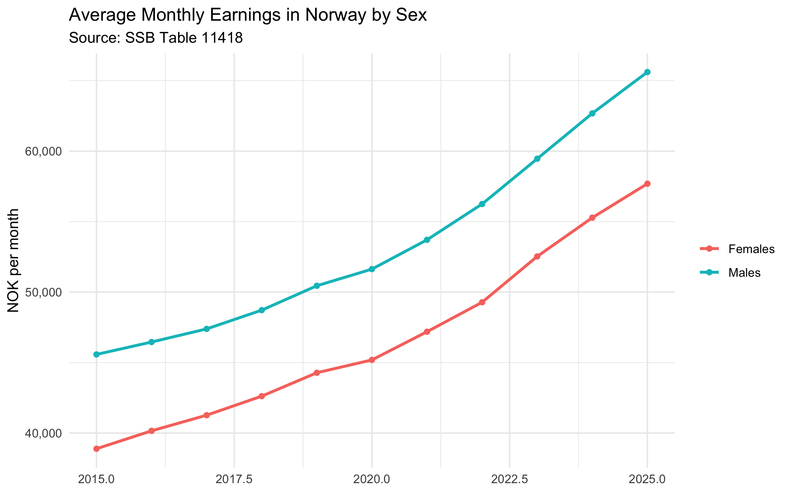
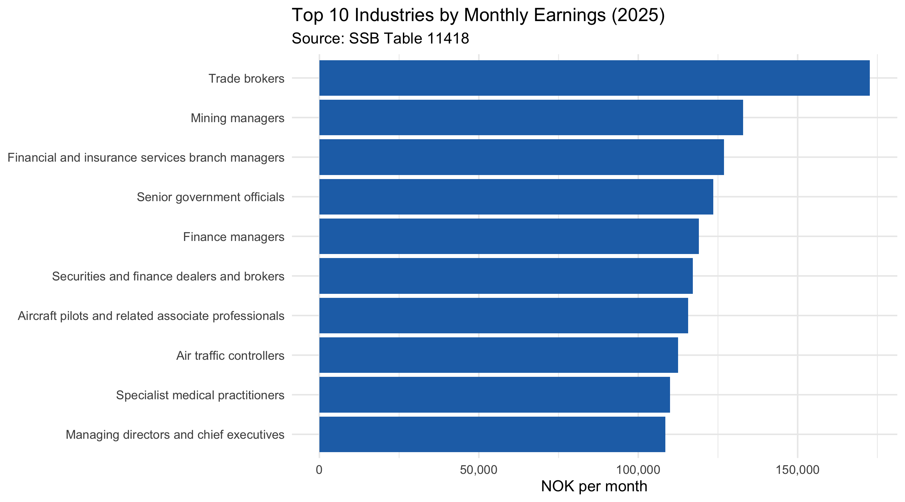
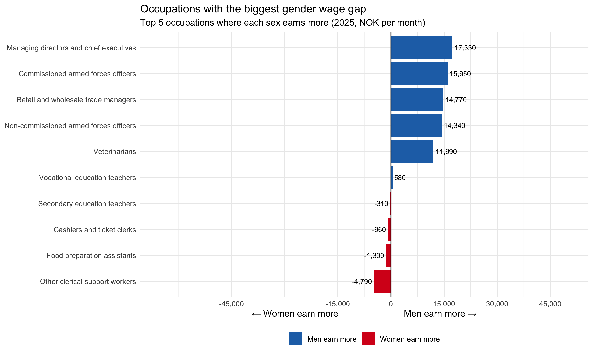
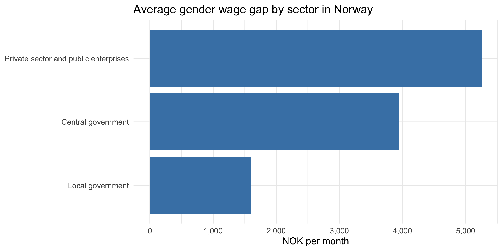

# Norwegian Wage Analysis

Analysis of Norwegian monthly earnings by occupation, sex, and sector using open data from [Statistics Norway (SSB)](https://www.ssb.no/en).

## Data source

**SSB Table 11418** — Monthly earnings by occupation, sex, sector, and year.  
Fetched directly via the [PxWebApiData](https://cran.r-project.org/package=PxWebApiData) R package. Data covers average monthly earnings for all employees.

## Project structure

```
R/
  fetch_data.R   # download and clean data from SSB API
  analysis.R     # plots and summary statistics
data/            # saved locally, not tracked by git
output/          # generated plots, not tracked by git
```

## How to run

```r
install.packages(c("PxWebApiData", "dplyr", "ggplot2", "readr", "scales", "tidyr"))

source("R/fetch_data.R")
source("R/analysis.R")
```

## Findings

### 1. Earnings over time by sex
Monthly earnings have increased significantly over the last 10 years for both men and women. The gender wage gap has remained mostly stable throughout, with little variation from the trend. Growth slowed noticeably between 2019 and 2020, likely reflecting the economic impact of COVID-19, but has since accelerated — growing faster each year than before 2019.



### 2. Top 10 highest paying occupations
Trade brokers stand out as the highest paid occupation by a significant margin. The top 10 are generally competitive, high-skill professions that command premium salaries.



### 3. Gender wage gap by occupation
The largest wage gaps in favour of men are found in management and military occupations — managing directors, commissioned and non-commissioned armed forces officers, and retail and wholesale trade managers. In occupations where women appear to earn more, the gaps are considerably smaller, and in one case the gap actually favours men slightly. This suggests that while reverse gaps exist, they are far smaller in magnitude than those favouring men.



### 4. Gender wage gap by sector
The wage gap is largest in the private sector and public enterprises (which includes state-owned companies such as Equinor), and smallest in local government. Central government sits in the middle. This is consistent with the hypothesis that more regulated and transparent wage-setting in the public sector reduces the gender wage gap.



## Limitations

- SSB data is aggregated at the occupation level. Individual sample sizes (number of workers per occupation) are not available, so results should be interpreted with caution.
- Occupations with high standard deviation in earnings were excluded from the wage gap analysis, as a high SD indicates a broad category where the mean is not representative.
- Data covers average monthly earnings and does not account for hours worked, seniority, or education level.
- "Private sector and public enterprises" is a combined SSB category and includes both fully private companies and state-owned enterprises.
